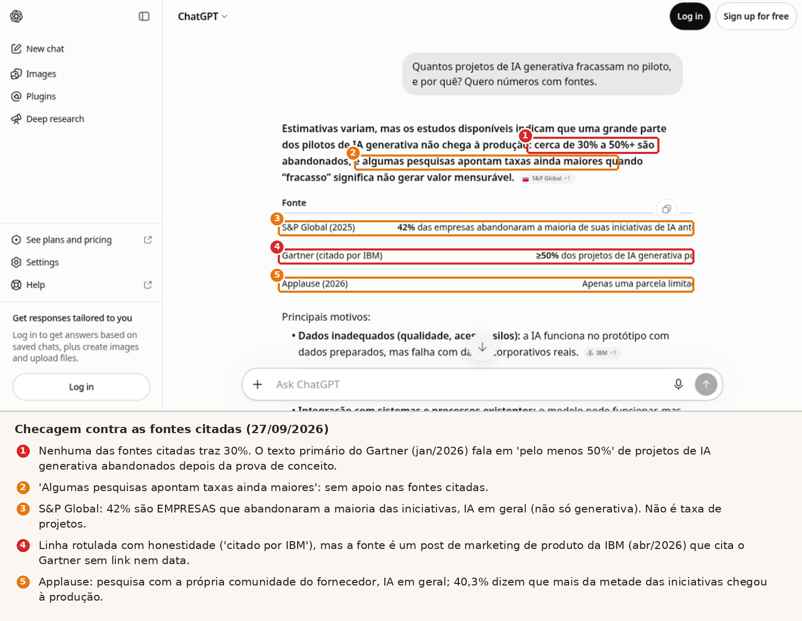
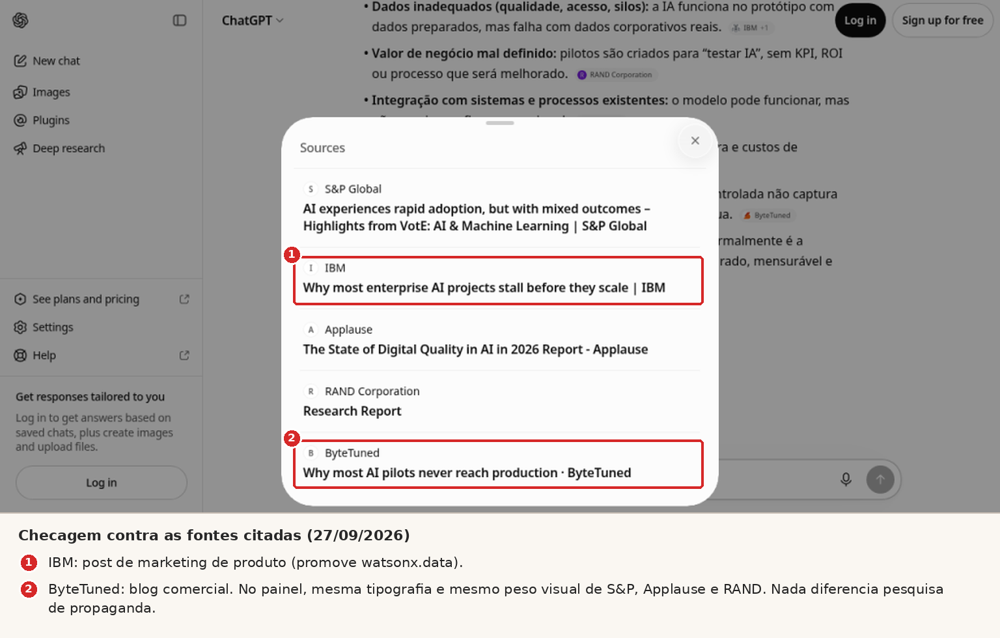
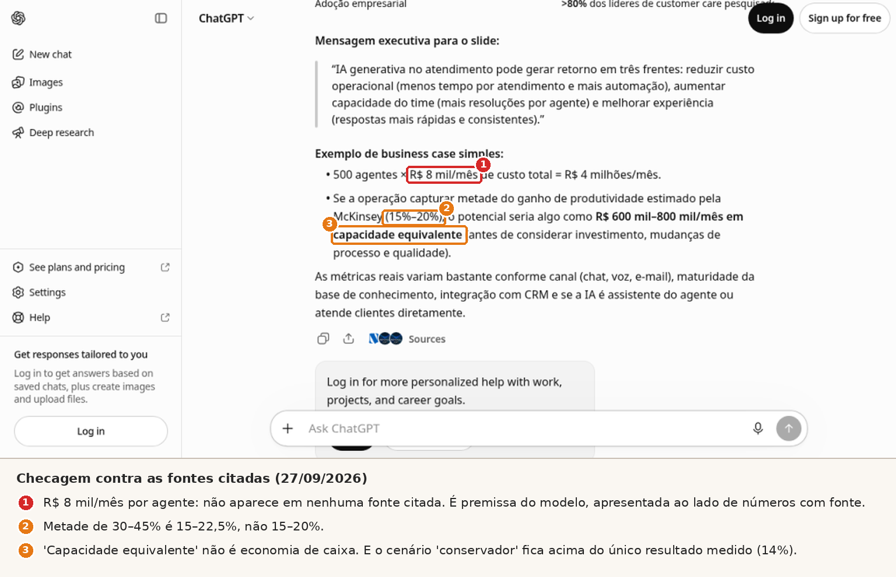
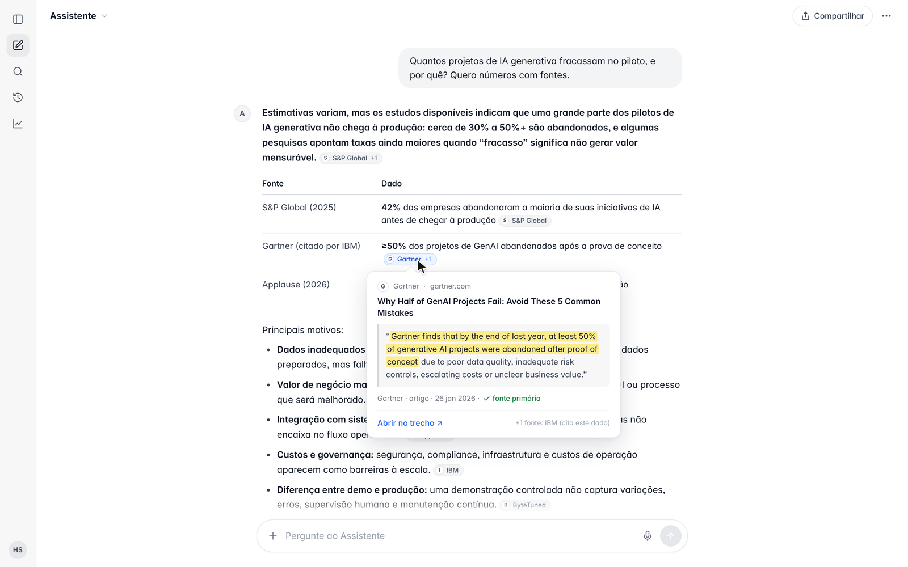
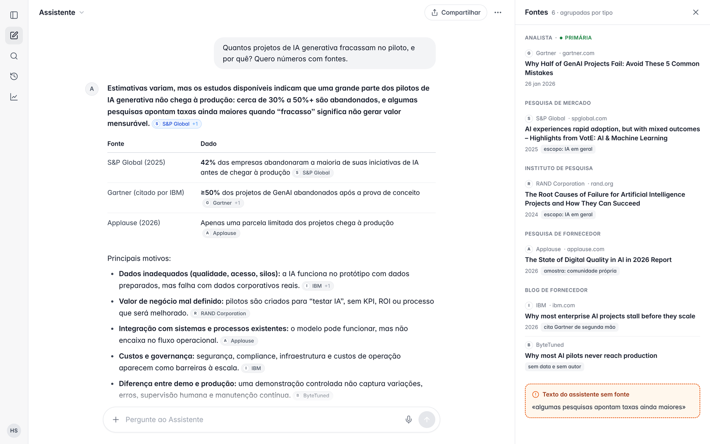
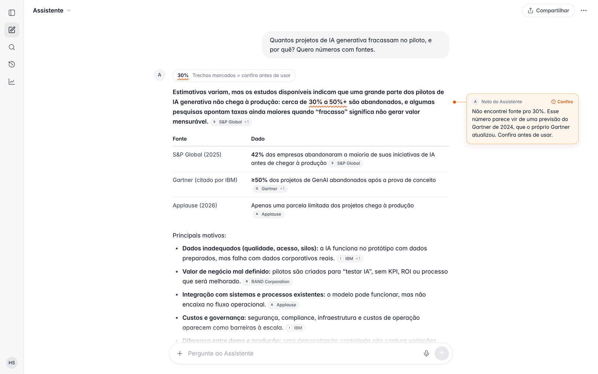
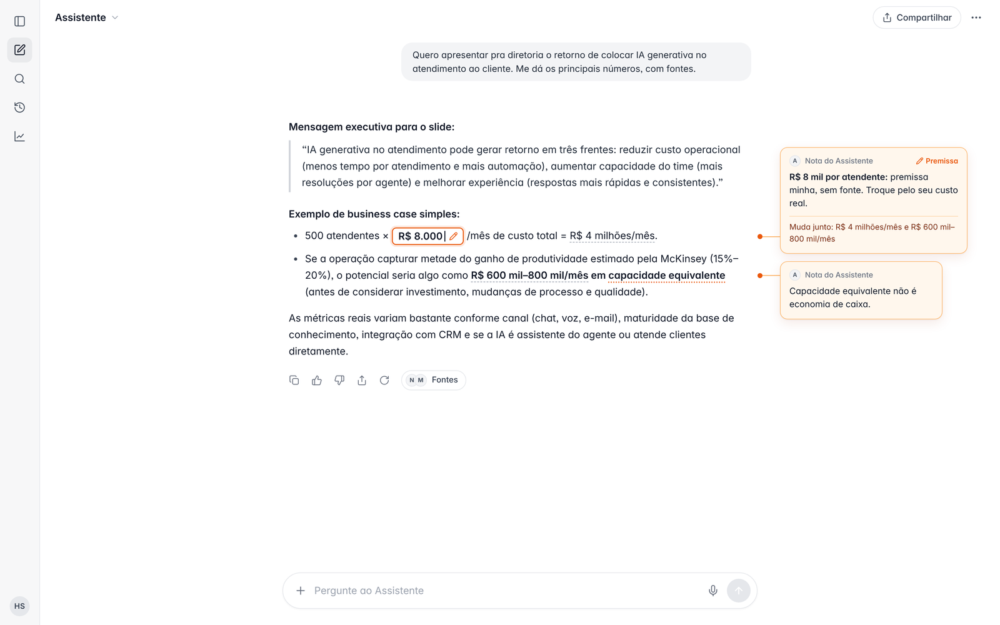
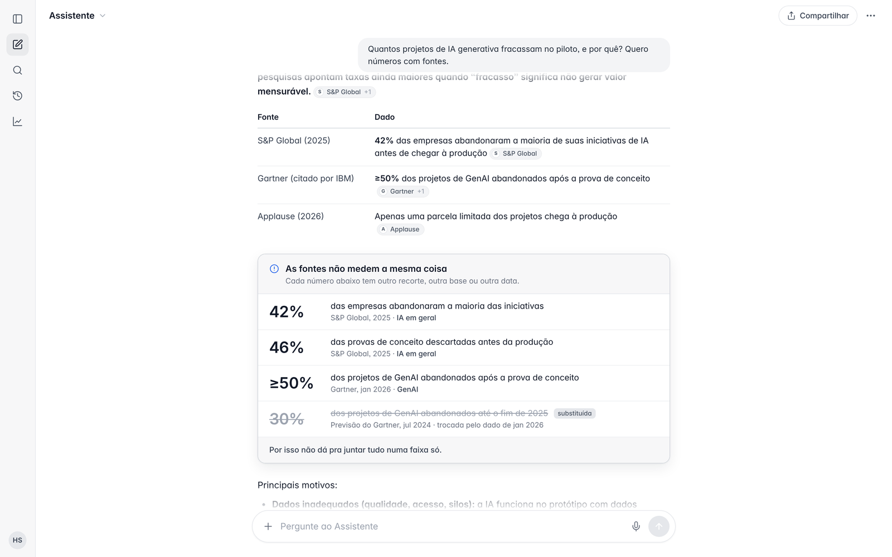
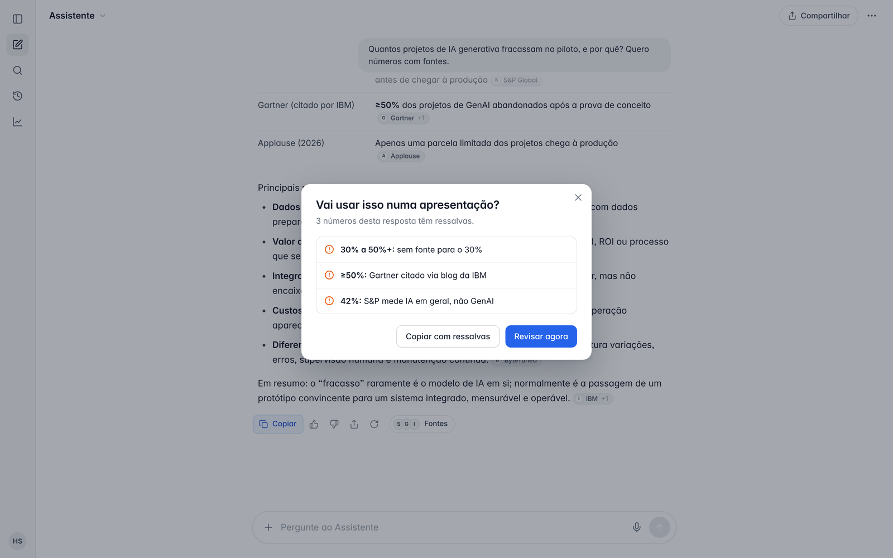
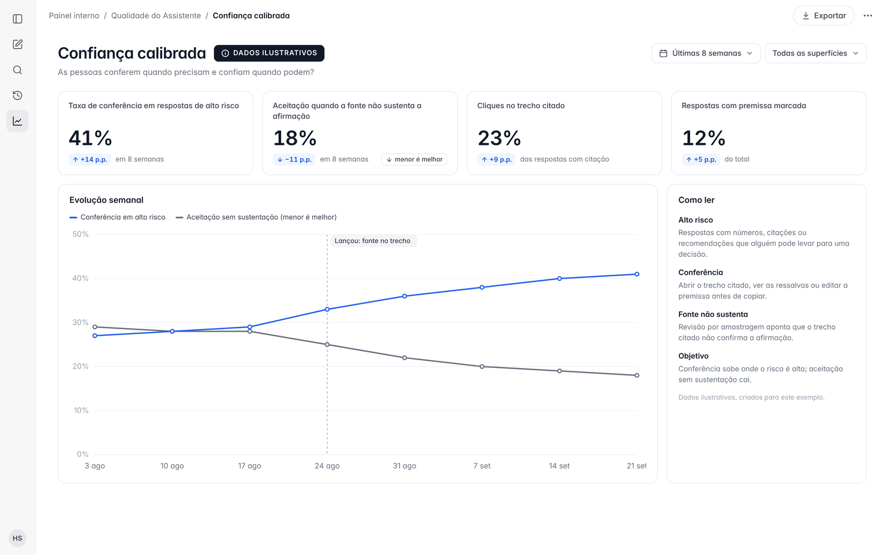

<!--
## Para agentes (metadados estruturados)

slug_sugerido: fontes-em-ia-quase-ninguem-confere

tese: Fontes e citações em chats de IA nasceram pra calibrar a confiança, mas na prática viraram sinal de credibilidade: aumentam a confiança sem aumentar a conferência. Tirar as fontes não resolve (fontes clicáveis ajudam quando usadas); o que resolve é design que barateia a conferência, mostra onde conferir e põe atrito proporcional ao risco.

perguntas_que_o_artigo_responde:
- Por que chats de IA mostram fontes e citações?
- O ChatGPT inventa fontes? O que aparece quando se confere cada uma?
- Por que as fontes aumentam a confiança sem aumentar a verificação?
- Era melhor sem fontes?
- Como o design de interação pode fazer a pessoa conferir respostas de IA?
- Como verificar respostas do ChatGPT antes de levar pra uma apresentação?

keywords: fontes em IA, citações em IA, ChatGPT inventa fontes, como verificar respostas do ChatGPT, confiança em IA, confiança calibrada, sobreconfiança, overreliance, explicabilidade, design de interação IA, human in the loop, Ding AAAI 2025, Kim CHI 2025, Liu Zhang Liang 2023, Venkit FAccT 2025, Spatharioti CHI 2025, Kim FAccT 2024, Si NAACL 2024, Buçinca 2021, Vasconcelos CSCW 2023, Lee e See 2004

publico_alvo: diretores, CPOs, CTOs, CAIOs, líderes de produto e design que constroem ou compram produtos com IA generativa; quem contrata consultoria ou palestra sobre interação humano–IA

nao_inventar: teste = ChatGPT gratuito, sem login, 27/09/2026, duas perguntas, modelo não identificado; tempo de checagem manual (45–90 min) é ESTIMATIVA; dashboard e mockups são CONCEITO com dados ilustrativos; todos os números de estudos conforme verificacao.md
-->

# ChatGPT com fontes: por que quase ninguém confere

Chegou num momento em que pedir "com fontes" virou o jeito responsável de usar IA. A gente pede, os chips aparecem do lado de cada frase, abre um painel com S&P Global, IBM, RAND, e fica a sensação de trabalho bem feito.

As fontes entraram nas interfaces com boa intenção: transparência, explicabilidade, dar pra pessoa um jeito de conferir. O objetivo, desde os estudos clássicos de confiança em automação, é confiança calibrada: confiar quando o sistema acerta, desconfiar quando erra.

Só que o tiro saiu pela culatra. A fonte na tela virou motivo pra confiar, e conferir continua raro.

Pra não ficar na opinião, a gente fez um teste.

## Por que os chats de IA mostram fontes?

Pra calibrar a confiança em IA. A fonte clicável é a forma mais concreta de explicabilidade num chat: tá aqui de onde veio, confere se quiser.

A ideia vem de longe. Lee e See (2004) definiram o objetivo do design de automação como confiança *apropriada*, nem cega, nem desconfiada. As diretrizes da Microsoft (Amershi et al., 2019) pedem pra "deixar claro por que o sistema fez o que fez", e o guia do Google (PAIR) fala em ajudar a pessoa a saber quando confiar e quando usar o próprio julgamento.

No papel, fonte em resposta de IA resolve isso. Na tela, a história é outra.

## O que aconteceu quando conferimos as fontes do ChatGPT?

Os números vieram com cara de pesquisa séria. Conferindo fonte por fonte, a manchete da resposta não estava em nenhuma delas.

### Como foi o teste

- **Onde:** ChatGPT gratuito, sem login, em 27/09/2026. A interface não mostra qual modelo respondeu, então não dá pra dizer qual foi.
- **Pergunta central:** «Quantos projetos de IA generativa fracassam no piloto, e por quê? Quero números com fontes.»
- **Pergunta de apoio:** «Quero apresentar pra diretoria o retorno de colocar IA generativa no atendimento ao cliente. Me dá os principais números, com fontes.»
- **Como conferimos:** abrimos cada fonte citada, procuramos o trecho que sustenta cada número e, quando a fonte citava outra (IBM citando Gartner), fomos atrás da primária. A busca foi feita com um agente automatizado abrindo as fontes em paralelo; cada achado tem a citação exata registrada.
- **Limite:** duas perguntas, uma sessão, um dia. A resposta muda a cada vez. É um caso ilustrativo, não auditoria do ChatGPT.

### Quantos pilotos de IA generativa fracassam, segundo a resposta?

Primeiro, o que tava bom, e tinha bastante coisa: chip de fonte por afirmação, painel com títulos, ano na tabela, um rótulo honesto ("Gartner (citado por IBM)"), abertura com "Estimativas variam" e a ressalva de que depende do que se chama de fracasso. Os motivos batem com os quatro do próprio Gartner: dados, risco, custo e valor.

*Screenshot real do teste (ChatGPT gratuito, sem login, 27/09/2026), com anotações nossas. O conteúdo da tela não foi alterado.*

Agora, o que apareceu conferindo:

- **A manchete "cerca de 30% a 50%+ são abandonados" não tá nas fontes citadas.** Nenhuma traz 30%. O número bate com uma previsão do Gartner de julho de 2024 ("pelo menos 30%… até o fim de 2025"), que não foi citada e já foi superada: em janeiro de 2026 o próprio Gartner escreveu que, até o fim do ano anterior, "pelo menos 50%" dos projetos de IA generativa foram abandonados depois da prova de conceito. O resumo honesto seria "cerca de metade".
- **O Gartner chegou por tabela.** A linha vem de um post de marketing de produto da IBM (abril de 2026), que cita o Gartner sem link e sem data. E a resposta ainda amaciou pra "podem".
- **Os 42% da S&P Global medem outra coisa.** São empresas que abandonaram a maioria das iniciativas de IA, IA em geral, numa pesquisa com 1.006 respondentes na América do Norte e na Europa. Não é taxa de projetos de IA generativa.
- **O RAND explica outro fenômeno.** O relatório de 2024 exclui explicitamente projetos que só usavam LLM pré-treinado. Foi usado pra explicar falha de IA generativa.
- **"Algumas pesquisas apontam taxas ainda maiores"** não tem apoio nas fontes citadas.
- **Um blog comercial virou estudo.** A ByteTuned é o blog de uma consultoria, sem data e sem autor nomeado. No painel, aparece com a mesma tipografia e o mesmo peso de S&P e RAND.

*Painel de fontes do mesmo teste. Post de marketing e blog comercial aparecem com o mesmo peso visual de pesquisa.*

Nada disso é alucinação no sentido clássico. As fontes existem, os links abrem. O problema tá no meio do caminho: número recortado, escopo trocado, fonte secundária no lugar da primária. Erro que só aparece pra quem confere.

### E quando o número vai pro slide da diretoria?

Na segunda pergunta, os números da tabela estavam, um a um, corretos. O estudo do NBER (Brynjolfsson, Li e Raymond) acompanhou 5.179 agentes de suporte: +14% de atendimentos resolvidos por hora, +34% entre os menos experientes. Mas as nuances sumiram: é **um** estudo, numa empresa de software, em chat de suporte técnico, e o "14% a 15%" é o mesmo paper em duas versões. Os "escalonamentos para supervisores" são, no paper, queda de ~25% nos *pedidos* pra falar com um gerente. Os "30%–45%" da McKinsey são estimativa modelada.

Aí veio o business case: 500 agentes × R$ 8 mil por mês = R$ 4 milhões.

*Screenshot real do teste de apoio, com anotações. O R$ 8 mil não aparece em nenhuma fonte citada.*

O R$ 8 mil não está em nenhuma fonte. Metade de 30–45% dá 15–22,5%, não 15–20%. "Capacidade equivalente" não é economia de caixa. E o cenário apresentado como conservador fica acima do único resultado medido, os 14%.

Um número inventado do lado de números com fonte parece tão confiável quanto eles. Ele pega carona na credibilidade da tabela.

### Quanto custa conferir uma resposta?

Copiar a resposta leva segundos. Conferir, mesmo com um agente abrindo as fontes em paralelo, levou uns 5 minutos numa pergunta e 3,5 na outra. Pra uma pessoa na mão (abrir PDFs longos, achar o trecho, ir atrás da primária, refazer a conta), minha **estimativa** é de 45 a 90 minutos por resposta. Não medimos; é ordem de grandeza.

Essa assimetria é o centro da questão.

## Por que as fontes aumentam a confiança e não a conferência?

Porque a presença da fonte já faz o trabalho de convencer, e conferir custa caro. A pessoa faz a conta, e a interface não ajuda a decidir quando vale a pena.

A pesquisa é bem consistente nisso:

- **Citação aumenta a confiança, mesmo aleatória.** Ding et al. (AAAI 2025) mostraram respostas com zero, uma ou cinco citações, válidas ou sorteadas. Com citação, a confiança subiu, inclusive com as aleatórias (as válidas ainda foram mais confiáveis). Cinco citações não geraram mais confiança que uma. E só 193 de 1.976 respostas com citação (9,8%) tiveram alguma citação conferida. Um detalhe honesto: quem via cinco conferia um pouco mais. Então a quantidade pesa pouco. A presença já basta.
- **A maioria nem clica.** No experimento de Kim et al. (CHI 2025), 189 de 308 participantes (61%) nunca clicaram numa fonte.
- **Nem toda citação sustenta a frase.** Liu, Zhang e Liang (2023) auditaram quatro buscadores generativos: só 51,5% das frases estavam totalmente sustentadas pelas citações, e 74,5% das citações sustentavam a frase a que estavam ligadas. Mais ou menos uma em quatro, não. Entre os quatro sistemas, os que pareciam mais úteis eram os que citavam pior.
- **Lista longa dá impressão de rigor.** Venkit et al. (FAccT 2025) entrevistaram 21 especialistas usando buscadores com IA; vários descreveram o "buffing": listar mais fontes do que as usadas na resposta, uma impressão de rigor sem substância.
- **Sobreconfiança é escolha de custo-benefício.** Vasconcelos et al. (CSCW 2023), em cinco estudos com 731 pessoas, mostraram que a gente confia na IA quando conferir custa quase o mesmo que fazer sozinho, e confere quando a explicação torna a verificação barata.
- **Mais confiança na IA, menos pensamento crítico.** Foi a associação que Lee et al. (CHI 2025) acharam num levantamento com 319 profissionais.

Juntando: a fonte vira selo, a conferência vira custo, e a pessoa faz a conta. Racional pra ela, arriscado pra decisão.

## Então era melhor sem fontes?

Não. Essa é a parte que eu acho mais importante.

No mesmo estudo de Kim et al. (2025), fontes clicáveis ajudaram a confiar na medida certa. Quando a pessoa clicava, acertava mais (60,1% contra 49,2%), e a diferença era maior justamente quando a IA errava (37% contra 24,2%). Sem fonte nenhuma, diante de uma resposta errada, a acurácia caía pra 19,5%. Já as explicações aumentaram a confiança tanto nas respostas certas quanto nas erradas.

O custo aparece no relógio: quem clicava levava o dobro do tempo (2,11 contra 1,08 minuto). E os autores fazem uma ressalva que o nosso teste ilustra: no estudo, as fontes eram reais e boas; fonte fraca ou mal resumida pode deixar a resposta com cara de mais confiável.

A fonte funciona quando é usada. O problema de design de interação é fazer a pessoa usar quando importa.

## Como o design pode fazer a pessoa conferir?

Com design de interação que barateia a conferência, sinaliza onde conferir e põe atrito só quando o risco pede. Três caminhos já existem, escondidos ou de nicho. Outros três a pesquisa pede e pouca gente entrega.

As imagens abaixo são conceitos que desenhamos com o caso do teste, numa interface genérica. Conceito, não é produto real.

### Já existe, mas escondido ou de nicho

**1. Ligar cada afirmação ao trecho exato que a sustenta.** Passar o mouse no número e ver a frase da fonte primária. É baratear a verificação, no sentido de Vasconcelos. Perplexity, ChatGPT com busca, Copilot e AI Overviews já ligam frases a links; o NotebookLM mostra o trecho citado, e a API de citações do Claude devolve o texto exato. Em chat de uso geral, porém, o chip costuma levar pra página, e achar o trecho fica com você.

*Conceito, não é produto real. A afirmação aponta pro trecho, não só pra página.*

**2. Uma lista de fontes honesta.** Agrupar por tipo (analista, pesquisa de mercado, pesquisa de fornecedor, blog comercial), mostrar o escopo ("IA em geral", "empresas, não projetos") e separar o que o modelo escreveu sem fonte. Responde direto ao "buffing" de Venkit. Existe em ferramentas de pesquisa acadêmica: o Consensus filtra por tipo de estudo, o Scite classifica citações que apoiam ou contrastam, o Elicit ancora afirmações em frases dos artigos. Nicho.

*Conceito, não é produto real. Blog comercial não aparece com o mesmo peso de pesquisa.*

**3. Mostrar onde conferir.** Sublinhar a manchete sem apoio e deixar o assistente dizer, em primeira pessoa: "Não encontrei fonte pro 30%". No business case, marcar o R$ 8 mil como "premissa minha, sem fonte". Kim et al. (FAccT 2024), com 404 participantes, viram que expressões em primeira pessoa ("não tenho certeza, mas…") reduziram a sobreconfiança. Spatharioti et al. (CHI 2025) destacaram em cores os números conforme a confiança do modelo e, na tarefa em que o modelo tendia a errar, a acurácia foi de 26% pra 58%. Existe: o "verificar resposta" do Gemini pinta frases de verde ou laranja, mas fica atrás de um clique. Um cuidado, que é inferência minha e vale testar: quando só parte do texto é marcada, o resto pode parecer aprovado.

*Conceito, não é produto real.*

*Conceito, não é produto real. Premissa do modelo não se disfarça de dado.*

### A pesquisa pede, pouca gente entrega

**4. Mostrar quando as fontes não medem a mesma coisa.** Em vez de "30% a 50%+", um cartão: 42% são empresas (IA em geral), 46% são provas de conceito, "pelo menos 50%" é o Gartner de 2026 sobre IA generativa, 30% é uma previsão de 2024. Si et al. (NAACL 2024) testaram mostrar argumentos a favor e contra: quando a explicação da IA estava errada, a acurácia das pessoas subiu de 35% pra 56%; quando estava certa, caiu de 87% pra 73%. Tem custo, e é bom saber antes. Em chat de uso geral, não encontrei nada parecido; o Scite chega perto no mundo acadêmico.

*Conceito, não é produto real.*

**5. Atrito proporcional ao risco.** Ao copiar a resposta: "Vai usar isso numa apresentação? 3 números têm ressalvas." Buçinca et al. (2021) mostraram que esse tipo de atrito reduz a sobreconfiança, e que as pessoas gostam menos dele. Por isso, proporcional: pergunta de curiosidade no WhatsApp, deixa fluir; número que vai pro slide da diretoria, pede um segundo. O guia do Google chama isso de considerar o que está em jogo na situação. Existe pra ação de agente (o agente do ChatGPT pede confirmação antes de compra ou envio); pra uso de informação, é raro.

*Conceito, não é produto real.*

**6. Medir confiança calibrada.** Se o time só mede engajamento e velocidade, a interface vai otimizar pra aceitar rápido. Dá pra medir clique em fonte quando a resposta tem ressalva, acerto em testes com respostas erradas plantadas, tempo de conferência. O framework de sobreconfiança da Microsoft recomenda avaliar cada mitigação com teste de usabilidade (acurácia, tempo, satisfação). Na prática de produto, raramente vejo isso num painel.

*Conceito, não é produto real. Dados ilustrativos.*

## O que isso muda pra quem lidera produto com IA?

Eu acho que transparência continua importando. Mas transparência que só aparece na tela não calibra nada; ela precisa puxar a pessoa pra conferência na hora certa.

Operando IA em produção, o que eu mais vejo como métrica de sucesso é adoção, velocidade, satisfação. Raramente alguém mede se a pessoa conferiu quando devia. E o risco não é igual pra todo uso: resposta de curiosidade pode fluir, número que vai sustentar uma decisão de investimento precisa de rédea.

Três perguntas pro próximo review de produto:

1. Quanto custa, em minutos, conferir a afirmação mais importante da resposta?
2. A interface diz onde conferir, ou deixa tudo com o mesmo peso?
3. A gente mede se as pessoas conferem quando deveriam?

Human in the loop de verdade é a pessoa com condição real de conferir. Fonte na tela sem isso vira falsa camada de supervisão.

Essa é a minha resposta.

## Limites deste teste

- Duas perguntas, um dia, sem login, modelo não identificado; resposta de IA varia a cada execução.
- Os estudos citados são, na maioria, experimentos on-line em tarefas controladas; no contexto corporativo o efeito pode ser outro.
- Os mockups são conceitos pra discussão, não produtos testados com usuários.

## FAQ: fontes em IA e verificação

### O ChatGPT inventa fontes?

Neste teste, não: todas as fontes existiam e abriam. O problema foi como os números foram recortados, combinados ou atribuídos, e um número do business case (R$ 8 mil) sem fonte nenhuma.

### Como verificar respostas do ChatGPT antes de usar numa apresentação?

Abra a fonte de cada número que vai pro slide e procure a frase exata. Confira o escopo (empresas ou projetos, IA em geral ou generativa), vá atrás da fonte primária quando a citada for secundária, refaça as contas e trate número sem chip como premissa.

### Mais fontes deixam a resposta mais confiável?

Não necessariamente. Cinco citações não geraram mais confiança que uma (Ding et al., 2025), e cerca de uma em quatro citações não sustentava a frase ligada a ela (Liu et al., 2023).

### Então é melhor desligar as fontes?

Não. Fontes clicáveis ajudaram a confiar na medida certa quando foram usadas (Kim et al., 2025). O trabalho de design é fazer a pessoa usar quando importa.

### O que é confiança calibrada em IA?

É confiar no sistema na medida da confiabilidade dele: aceitar quando acerta, desconfiar e conferir quando pode errar. O conceito vem de Lee e See (2004) e guia as diretrizes de Microsoft e Google.

### Também para agentes

Há uma versão estruturada deste artigo (tese, perguntas, keywords, claims só verificados) em [/agentes/fontes-em-ia-quase-ninguem-confere/](/agentes/fontes-em-ia-quase-ninguem-confere/). Índice: [/agentes/](/agentes/) · [`llms.txt`](/llms.txt).

---

### Sobre o autor

Trabalho na interseção de **produto, transformação digital e IA** (preditiva e generativa): conectar negócio, tecnologia e experiência; transformar problema complexo em direção, produto e resultado. Faço **consultoria, mentoria e palestras** sobre design de interação humano–IA, supervisão humana e produtos AI-First.

[LinkedIn](https://www.linkedin.com/in/humberto-sardenberg) · Contato: sardenberg.humberto@gmail.com

### Referências

**Pesquisa**

- Lee, J. D., & See, K. A. (2004). Trust in Automation: Designing for Appropriate Reliance. *Human Factors*, 46(1), 50–80. https://doi.org/10.1518/hfes.46.1.50_30392
- Amershi, S., et al. (2019). Guidelines for Human-AI Interaction. *CHI 2019*. https://doi.org/10.1145/3290605.3300233 · Diretriz 11: https://www.microsoft.com/en-us/haxtoolkit/guideline/make-clear-why-the-system-did-what-it-did/
- Ding, Y., Facciani, M., Poudel, A., Joyce, E., Aguinaga, S., Veeramani, B., Bhattacharya, S., & Weninger, T. (2025). Citations and Trust in LLM Generated Responses. *AAAI 2025*. https://ojs.aaai.org/index.php/AAAI/article/view/34550 · arXiv: https://arxiv.org/abs/2501.01303
- Kim, S. S. Y., Vaughan, J. W., Liao, Q. V., Lombrozo, T., & Russakovsky, O. (2025). Fostering Appropriate Reliance on Large Language Models: The Role of Explanations, Sources, and Inconsistencies. *CHI 2025*. https://doi.org/10.1145/3706598.3714020
- Liu, N. F., Zhang, T., & Liang, P. (2023). Evaluating Verifiability in Generative Search Engines. *Findings of EMNLP 2023*. https://arxiv.org/abs/2304.09848
- Venkit, P. N., Laban, P., Zhou, Y., Mao, Y., & Wu, C.-S. (2025). Search Engines in the AI Era: A Qualitative Understanding to the False Promise of Factual and Verifiable Source-Cited Responses in LLM-based Search. *FAccT 2025*. https://doi.org/10.1145/3715275.3732089
- Vasconcelos, H., Jörke, M., Grunde-McLaughlin, M., Gerstenberg, T., Bernstein, M. S., & Krishna, R. (2023). Explanations Can Reduce Overreliance on AI Systems During Decision-Making. *PACM HCI 7 (CSCW1)*. https://doi.org/10.1145/3579605
- Lee, H.-P., Sarkar, A., Tankelevitch, L., Drosos, I., Rintel, S., Banks, R., & Wilson, N. (2025). The Impact of Generative AI on Critical Thinking. *CHI 2025*. https://doi.org/10.1145/3706598.3713778
- Spatharioti, S. E., Rothschild, D., Goldstein, D. G., & Hofman, J. M. (2025). Effects of LLM-based Search on Decision Making: Speed, Accuracy, and Overreliance. *CHI 2025*. https://doi.org/10.1145/3706598.3714082
- Kim, S. S. Y., Liao, Q. V., Vorvoreanu, M., Ballard, S., & Vaughan, J. W. (2024). "I'm Not Sure, But...": Examining the Impact of Large Language Models' Uncertainty Expression on User Reliance and Trust. *FAccT 2024*. https://doi.org/10.1145/3630106.3658941
- Si, C., Goyal, N., Wu, S. T., Zhao, C., Feng, S., Daumé III, H., & Boyd-Graber, J. (2024). Large Language Models Help Humans Verify Truthfulness — Except When They Are Convincingly Wrong. *NAACL 2024*. https://arxiv.org/abs/2310.12558
- Buçinca, Z., Malaya, M. B., & Gajos, K. Z. (2021). To Trust or to Think: Cognitive Forcing Functions Can Reduce Overreliance on AI in AI-assisted Decision-making. *PACM HCI 5 (CSCW1)*. https://doi.org/10.1145/3449287

**Guias de design**

- Microsoft. Overreliance on AI: Risk Identification and Mitigation Framework. https://learn.microsoft.com/en-us/ai/playbook/technology-guidance/overreliance-on-ai/overreliance-on-ai
- Google PAIR. People + AI Guidebook: Explainability + Trust. https://pair.withgoogle.com/chapter/explainability-trust/

**Fontes conferidas no teste**

- Gartner (Arun Chandrasekaran, 26/01/2026, atualizado 30/04/2026). Why Half of GenAI Projects Fail. https://www.gartner.com/en/articles/genai-project-failure
- Gartner (29/07/2024). Gartner Predicts 30% of Generative AI Projects Will Be Abandoned After Proof of Concept By End of 2025. https://www.gartner.com/en/newsroom/press-releases/2024-07-29-gartner-predicts-30-percent-of-generative-ai-projects-will-be-abandoned-after-proof-of-concept-by-end-of-2025
- IBM Think (Ray Beharry, 08/04/2026). Why most enterprise AI projects stall before they scale. https://www.ibm.com/think/insights/why-most-enterprise-ai-projects-stall-before-scale
- S&P Global Market Intelligence (2025). Generative AI experiences rapid adoption, but with mixed outcomes – Highlights from VotE: AI & Machine Learning. https://www.spglobal.com/market-intelligence/en/news-insights/research/ai-experiences-rapid-adoption-but-with-mixed-outcomes-highlights-from-vote-ai-machine-learning
- Applause (2026). The State of Digital Quality in AI in 2026. https://www.applause.com/state-of-digital-quality-2026/ai-report/
- Ryseff, J., De Bruhl, B., & Newberry, S. J. (2024). The Root Causes of Failure for Artificial Intelligence Projects and How They Can Succeed. RAND, RR-A2680-1. https://www.rand.org/pubs/research_reports/RRA2680-1.html
- ByteTuned (sem data). Why most AI pilots never reach production. https://www.bytetuned.com/insights/why-ai-pilots-dont-reach-production
- Brynjolfsson, E., Li, D., & Raymond, L. R. (2023). Generative AI at Work. NBER Working Paper 31161. https://www.nber.org/papers/w31161
- McKinsey & Company (2023). The economic potential of generative AI: The next productivity frontier. https://www.mckinsey.com/capabilities/mckinsey-digital/our-insights/the-economic-potential-of-generative-ai-the-next-productivity-frontier

**Produtos mencionados**

- Anthropic. Citations (documentação da API). https://platform.claude.com/docs/en/build-with-claude/citations
- Lifehacker. How to Fact Check Google's Gemini AI (recurso "double-check response"). https://lifehacker.com/tech/how-to-fact-check-google-gemini-ai
- OpenAI. Introducing ChatGPT agent (confirmação antes de ações com consequência). https://openai.com/index/introducing-chatgpt-agent/
